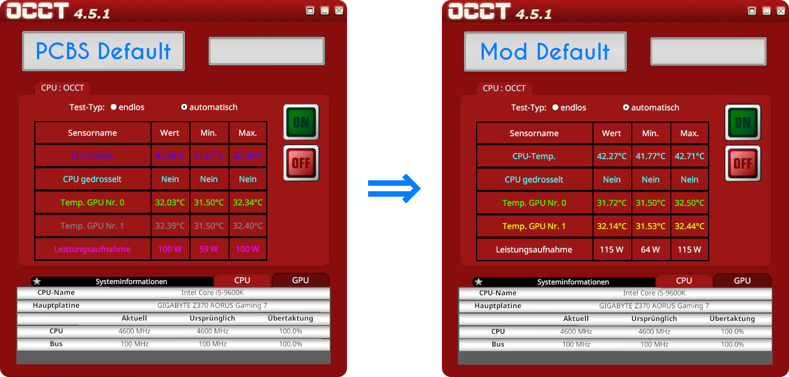

OCCT Colors v2
===

## Description
This mod is a [BepInEx](https://docs.bepinex.dev/index.html "BepInEx.dev") plugin for [PC Building Simulator](https://www.pcbuildingsim.com/pc-building-simulator "PCBuildingSim.com") (PCBS) to change the font colors in the OCCT app to whatever RGB color values are specified in the configuration file.

## Installation
1. Backup your save games located in `PC Building Simulator\Saves`.
2. If not installed already, install the mod loader [BepInEx 5.4.19](https://github.com/BepInEx/BepInEx/releases "BepInEx Releases - Github.com") or newer. Just download the ZIP file (x86 or x64, depending on your system) and unpack it into the installation directory of PCBS. BepInEx provides more details [here](https://docs.bepinex.dev/articles/user_guide/installation/index.html "BepInEx Installation - BepInEx.dev").
3. Run PCBS at least once after installing BepInEx, so that BepInEx can create its configuration file. If BepInEx was installed properly, it should have created a `BepInEx.cfg` file in `PC Building Simulator\BepInEx\config`.
4. Download the latest release of this mod from [Github](https://www.github.com/cubinator/occt-colors-v2/releases "OCCT Colors v2 Releases - Github.com") or NexusMods (TBA) <!-- TODO: Add releases --> and unpack the ZIP file into the installation directory of PCBS.
5. Enjoy :)

## Configuration
The colors in the OCCT app can be configured in `PC Building Simulator\BepInEx\config\OCCTColors.ini`. PCBS needs to be restarted in order for changes to the color configuration to take effect.

## Manual Compilation and Installation
Compiling this mod does not require Visual Studio, but it requires PCBS+BepInEx to be installed. The makefile utilizes the C# compiler `csc.exe` that comes with the .NET framework and which is located at `%windir%\Microsoft.NET\Framework64\v3.5\csc.exe`.
1. Make sure BepInEx is installed properly as described above in steps 1-3.
2. Download `OCCTColors.cs` and `make.cmd`.
3. *Optional:* You can change the target .NET framework version in `make.cmd`. It defaults to v3.5 which is also PCBS's target .NET framework version and which is almost certainly already installed on your system.
4. Run `make.cmd`. When running `make.cmd` for the first time, pass the path to the installation directory of PCBS as the first argument.
5. If the compilation succeeded, place the newly created `OCCTColors.dll` in `PC Building Simulator\BepInEx\plugins`.
6. Enjoy :)

The configuration file `OCCTColors.ini` will be automatically generated when PCBS is launched.

## Other Notes
 - Tested for PCBS v1.15.3 on Steam with BepInEx x64 5.4.19 on .NET Framework 3.5
 - The BepInEx GUID of this plugin is `com.bepinex.cubi.pcbs.occtcolors`
 - This mod is the successor to my now deprecated [PCBS OCCT Font Color Patch](https://www.github.com/cubinator/occt-colors "PCBS OCCT Font Color Patch - Github.com") PowerShell script.